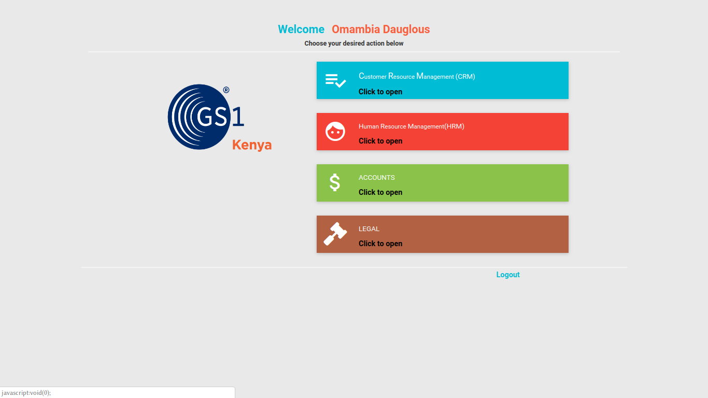
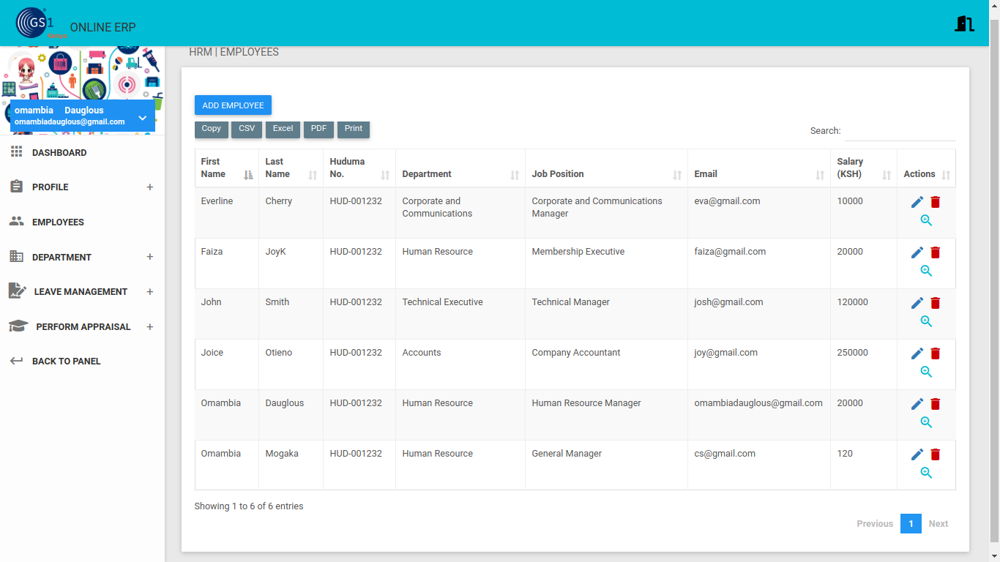
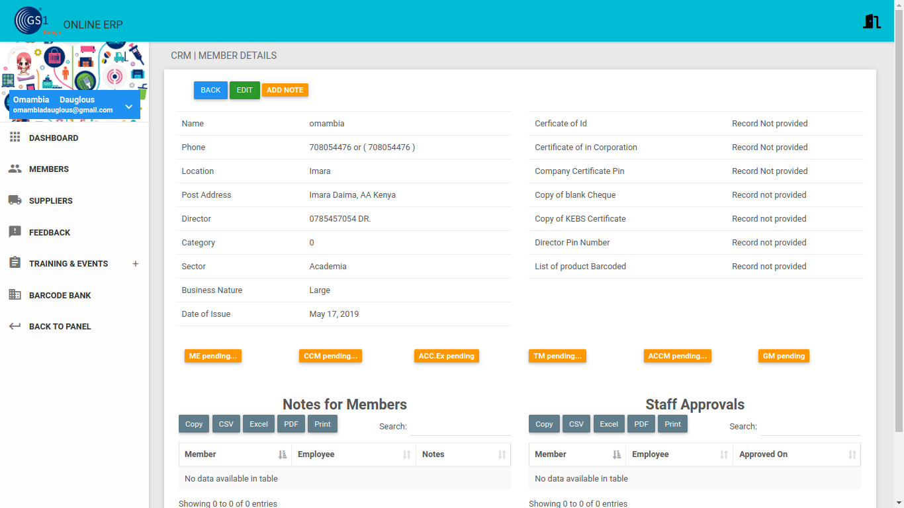
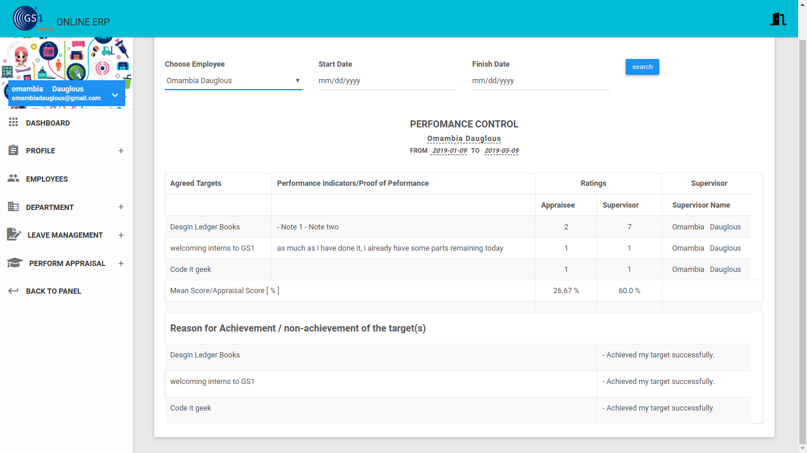

# GS1 Kenya ERP
>  This is the Enterprise Planning Resource(ERP) for GS1Kenya. It gives access and allows the company to manipulate some of its modules search as ACCOUNTS, Human Resource Module, Customer Resource Module and  Legal Module. 

## Getting Started
If you want to run the project locally on your machine.

### Prerequisites

You need to have at least python3.7 already installed or go to [python](https://python.org) and install.


### Installing

Follow the following instructions to install.
#### Create and activate a virtual Environment 

```
python -m venv  venv 
source venv/bin/activate
```
#### Run the project dependencies and Create databases
1. Create a database called ```gs1```
2. Run project Dependencies
```
(venv)$: pip install -r requirements.txt
(venv)$: python manage.py migrate
```
## Built With

* [Django](https://www.djangoproject.com/) - The web framework used
* [python language](https://www.python.org/) - Dependency Management

## Authors

* **Omambia Dauglous** 
## Screenshots
### Panel
 
### Employees
 
### Members
 
## Payroll
 
## Performance
 
## License

This project is licensed under the MIT License
## Acknowledgments

* My spirit towards code
* Joseph Oloo Otieno (kwach)
* GS1Kenya
* csdigital
